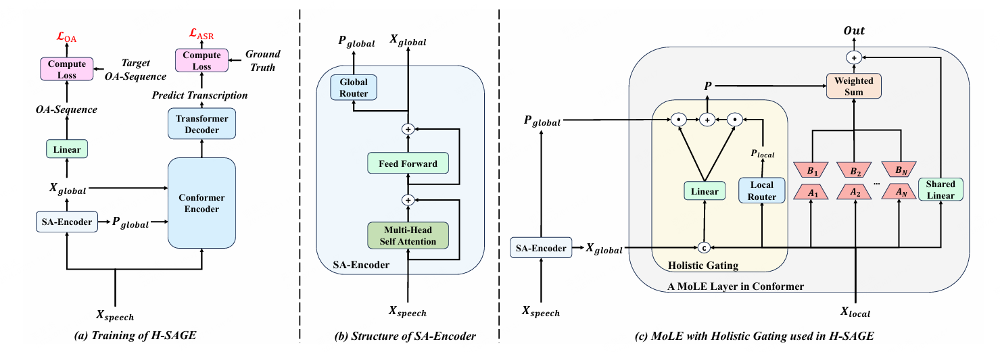
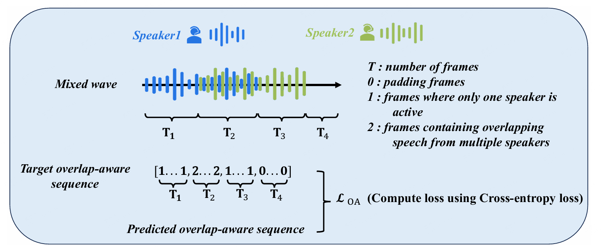

(简体中文|[English](./README.md))

# H-SAGE: Holistic Speaker-Aware Guided Experts for MoE-based Multi-Talker ASR

H-SAGE（Holistic Speaker-Aware Guided Experts）是一种面向多说话人自动语音识别（Multi-Talker Automatic Speech Recognition, MTASR）的架构，用于提升重叠语音场景下的转录能力。H-SAGE建立在GLAD框架基础之上，并针对其全局建模能力与专家路由机制进行了进一步优化。

我们的核心动机主要包括两个方面：

- **增强全局信息建模能力**：更强的全局声学信息提取能力能够为Encoder提供更加清晰的说话人活动线索，从而帮助模型更准确地区分不同说话人，提高重叠语音识别性能。
- **融合全局与局部信息进行专家分配**：专家路由不应仅依赖局部声学特征，而应综合考虑全局上下文与局部细粒度信息，从而实现更加合理的专家选择。

## 方法框架

我们提出的整体框架如图1所示。

<p align="center">  </p>

<p align="center"><em>Figure 1: 提出的 H-SAGE 架构概览。(a) SA-Encoder 提取全局特征，并通过 OA Loss 进行显式监督；(b) SA-Encoder 的具体结构，其核心为 Self-Attention 模块；(c) Holistic Gating 在专家权重分配时联合考虑全局信息与局部信息。</em></p>


### 加强全局提取能力

现有的 MoE-based MTASR 方法中，GLAD通过简单线性投影提取全局特征，同时缺乏显式监督机制，因此对长距离依赖关系和说话人动态变化的建模能力有限。

基于这一观察，我们提出使用SA-Encoder替代原有全局特征提取模块。SA-Encoder 基于Self-Attention结构构建，能够建模长时间范围内的声学依赖关系，从而学习更加鲁棒的全局表示。

进一步地，我们引入Overlap-Aware Loss对全局表示进行显式监督，通过预测每一帧对应的声学状态，强化模型对说话人活动模式的感知能力。

<p align="center">  </p>

<p align="center"><em>Figure 2: Overlap-Aware Loss</em></p>

这一设计验证了：增强全局信息建模能力能够有效反馈给Encoder，帮助模型更准确地区分不同说话人，从而提升MTASR整体性能。同时，该结论也表明，通过设计更强的全局特征提取器与监督目标，仍存在进一步提升多说话人识别能力的空间。


### 同时考虑全局和局部信息

除全局建模之外，我们进一步关注专家路由策略。

如图1(c)所示，在传统MoE结构中，专家选择通常主要依赖局部输入特征，难以充分利用跨时间范围的全局上下文信息。

因此，我们提出 Holistic Gating。该模块在计算专家权重时，同时融合来自局部特征与全局特征的信息，通过联合建模获得最终的专家分配结果。

实验结果表明，在 MoE-based MTASR 中，结合全局上下文与局部细粒度信息进行专家路由能够带来更加有效的专家协作，从而进一步提升模型性能。

更多分析与讨论请参考消融实验部分。

## 问题和回答

**Q1：由于 H-SAGE 在 2025 年 12 月完成，后续 GLAD 结构有所更新，H-SAGE 的性能如何？是否有对应实验结果？**

GLAD 的最新结构更新主要体现在 每个 MoLE 引入了独立的 Global Gating Router（而在早期版本中，所有 MoLE 共享同一个全局路由器）。这一改动主要影响路由机制的细粒度建模方式，与 H-SAGE 的核心设计目标并不冲突，因此两者在结构层面是相互独立的。

为了保证公平性，我们在更新后的 GLAD 框架基础上重新训练了 H-SAGE，并在相同实验设置下进行了对比。实验所使用的数据集与原论文保持一致。由于显存限制，我们在保持训练策略与超参数完全一致的前提下，对 batch size 进行了适当缩减。相关实现可参考 H-SAGE-NEW 目录。

实验结果如下表所示,从结果可以看出，在更新后的 GLAD 基础上，H-SAGE 在大多数指标上仍然保持一致或更优的性能，说明其设计具有较好的鲁棒性与可迁移性。

<div style="overflow-x: auto;">
  <table class="custom-table">
    <thead>
      <tr>
        <th rowspan="2">Method</th>
        <th rowspan="2">Parm.(M)</th>
        <th colspan="2">Librispeech</th>
        <th colspan="6">LibrispeechMix-2mix</th>
        <th colspan="6">LibrispeechMix-3mix (Generalization)</th>
      </tr>
      <tr>
        <th>Dev</th><th>Test</th>
        <th>Dev</th><th>Test</th><th>low</th><th>mid</th><th>high</th><th>OA-WER</th>
        <th>Dev</th><th>Test</th><th>low</th><th>mid</th><th>high</th><th>OA-WER</th>
      </tr>
    </thead>
    <tbody>
      <tr>
        <td>GLAD</td><td>35.31</td><td>3.4</td><td>3.8</td><td>6.2</td><td>6.2</td><td>5.0</td><td>6.3</td><td>9.2</td><td>6.8</td><td>20.9</td><td>21.1</td><td>14.7</td><td>21.1</td><td><b>27.3</b></td><td>21.0</td>
      </tr>
      <tr>
        <td>H-SAGE</td><td>35.83</td><td><b>3.3</b></td><td><b>3.5</b></td><td><b>6.0</b></td><td><b>5.8</b></td><td><b>4.4</b></td><td><b>5.9</b></td><td><b>9.1</b></td><td><b>6.5</b></td><td><b>19.9</b></td><td><b>19.9</b></td><td><b>13.3</b></td><td><b>19.6</b></td><td><b>27.3</b></td><td><b>20.3</b></td>
      </tr>
    </tbody>
  </table>
</div>


**Q2：为什么考虑OA Loss，而不是去设计一个speaker aware loss**

首先，引入显式监督信号的主要目的，是验证增强全局信息建模能力确实能够提升 MTASR 性能。从这一角度来看，监督形式并不唯一，其他类型的 loss 设计同样可能带来性能收益。

其次，在具体实现上，我们采用 OA Loss 主要基于其良好的泛化能力与较低的设计复杂度。OA Loss 通过对声学状态（如静音、单说话人及重叠语音）进行建模，使得模型结构更加简洁，同时在不同场景与说话人配置下具有更强的适应性。因此，我们选择 OA Loss 作为显式监督方案。

需要注意的是，我们的声学状态标签是基于混合语音的时长与时间偏移规则构造得到的，因此整体监督信号是较为粗粒度的近似标注，其中单说话人片段中仍可能包含静音等不确定因素。然而，即便在这种带有一定噪声的弱监督条件下，模型仍然取得了稳定提升，从而进一步验证了该方法设计的有效性与合理性。


## 联系我们
如有问题或合作意向，欢迎通过邮箱与我们联系：

guoyujie02@mail.nankai.edu.cn

## 引用
如果我们的工作或代码对您有所帮助，请考虑引用本项目对应论文，并对本项目并给予⭐支持。

```
TODO
```

## 致谢

本仓库是基于[ESPnet](https://github.com/espnet/espnet)框架。

部分实现参考并借鉴了以下开源项目，特此致谢：

- [LibrispeechMix](https://github.com/NaoyukiKanda/LibriSpeechMix)
- [Speaker-Aware-CTC](https://github.com/kjw11/Speaker-Aware-CTC)
- [GLAD](https://github.com/NKU-HLT/H-SAGE)